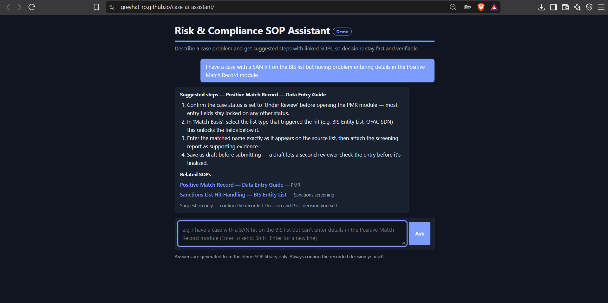

# Risk & Compliance SOP Assistant (Demo)

A static, client-side demo of an AI assistant that suggests case-resolution steps and links to relevant SOPs, built for a Risk & Compliance-style team. Hosted entirely on GitHub Pages — no backend, no API keys.

**Live demo:** https://greyhat-ro.github.io/case-ai-assistant/ — access code `RC-DEMO`

## How it works
This demo does **keyword-based retrieval**, not a real language model call, so the whole thing can run for free on GitHub Pages with no server:
1. `sops.js` holds a small library of demo SOPs, each with keywords and suggested steps.
2. When you ask a question, `app.js` scores every SOP by how many of its keywords appear in the question.
3. The top match's steps are shown as the suggested answer; the top few matches are listed as "Related SOPs" with real links to demo SOP pages in this repo.

Try: *"I have a case with a SAN hit on the BIS list but having problem entering details in the Positive Match Record module"* — it should surface both the PMR entry guide and the BIS hit-handling SOP.

## From demo to production
A real version would swap the keyword scorer for actual retrieval-augmented generation:
- Embed each SOP chunk with an embedding model and store it in a vector database (pgvector, Pinecone, etc.)
- On each question, retrieve the closest chunks and pass them to an LLM (e.g. via the Anthropic API) to generate the answer, grounded only in those chunks
- Put the whole thing behind company SSO restricted to the Risk & Compliance group, since GitHub Pages can't run a backend or truly restrict access
- Log every question and answer for audit purposes

The access code in this demo (`RC-DEMO`) is a UI-only gate for demonstration — it is visible in the source and is not real security.

## Run locally
Open `index.html` in a browser. No build step or dependencies.

## Files
- `index.html`, `style.css`, `app.js` — the chat UI and retrieval logic
- `sops.js` — demo SOP data (title, keywords, steps, link)
- `sops/*.html` — demo SOP pages that the chat links to

## Screenshot

